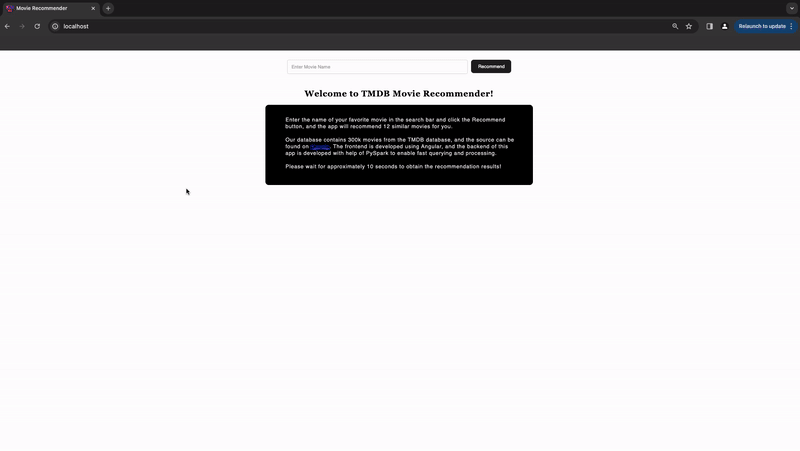

# Movie Recommendation Web Application


This end-to-end machine learning project involves the creation of a movie recommendation web application that leverages content-based filtering techniques. The application allows users to input a movie, and based on the information of that movie from the TMDB database, the system provides recommendations of 8 similar movies. These recommendations are presented in an intuitive interface using movie cards.

<p align="center">
    
</p>

## Usage

How to run this project on your local machine?

Please make sure you have [Docker](https://docs.docker.com/get-docker/) installed.

You may clone this repo and run the following command in the root of the project:

```bash
docker-compose up
```

The application will be available on http://localhost.

## Data

This project relies on the TMDB dataset obtained from [Kaggle](https://www.kaggle.com/datasets/asaniczka/tmdb-movies-dataset-2023-930k-movies), encompassing a vast collection of 930k movies.

Please review the [data license](https://opendatacommons.org/licenses/by/1-0/index.html) associated with this dataset for compliance with usage terms.

The dataset is continually updated on Kaggle, with the version used in this project last updated on January 12th, 2024. Due to its substantial size (~450MB), it is not included in this repository.

To enhance recommendation quality, we have filtered the original dataset, retaining approximately 300k movies based on criteria defined in `./data/data.py`.

To construct feature vectors for each movie, we initiate the process by tokenizing and vectorizing the original language, genres, and production countries data. These features are then combined with average vote, release year, revenue, runtime, and popularity data. The entire feature set undergoes `MinMaxScaler` transformation. Both the feature vectors and the original features are saved in Apache Parquet format, enabling efficient backend data retrieval.

If you wish to utilize the latest Kaggle dataset for recommendation purposes, download it and place it in `./data` after cloning this repository. To overwrite the existing processed data, modify the last line in `./data/data.py` as follows:

```python
processed_df.write.mode("overwrite").format("parquet").save("../backend/app/processed")
```

Navigate to the `./data` directory in your terminal and run:

```bash
python data.py
```

## Recommendation Algorithm

The content-based recommendation algorithm adopts the concept of k-nearest neighbors. As Apache Spark lacks native support for KNN, a custom implementation is provided in the backend.

When a user inputs a movie name, the backend API initiates the process by extracting the feature vector of the specified movie. Subsequently, it computes the Euclidean distance between feature vectors of the provided movie and all movies in the database. Finally, the API returns the 9 nearest neighbors, where the closest neighbor is the provided movie itself.

### Implementation

The following code snippet illustrates the implementation. Note, `df` is the database and `movie` is the provided movie title:

```python
# Extract features for the selected movie
movie_features = (
    df.filter(F.col("title") == movie).select("features").collect()[0]["features"]
)

# Define Euclidean distance calculation function
def euclidean_distance(vector):
    return float(movie_features.squared_distance(vector)) ** 0.5

# Register Euclidean distance as a Spark UDF
euclidean_distance_udf = spark.udf.register(
    "euclidean_distance", euclidean_distance, "float"
)

# Generate movie recommendations based on Euclidean distance
recommended = (
    df.withColumn("euclidean_distance", euclidean_distance_udf("features"))
    .orderBy("euclidean_distance", ascending=True)
    .limit(9)
    .drop("features")
)
```

### Challenge

The current implementation utilizes `SparseVector` objects for feature vectors, and the Euclidean distances are calculated using a UDF (user-defined function). While UDFs are versatile, they are executed in Python, which cannot directly leverage the efficiency of the JVM (Java Virtual Machine). The Spark engine, implemented in Java and Scala, runs on the JVM.

The use of a UDF in this context introduces a potential delay for users. When a user inputs a movie and clicks the submit button, the processing time may be approximately ~10 seconds before obtaining recommendations. In future iterations, an ideal optimization would involve replacing the UDF with Spark's built-in functions.

In the future, by transitioning to Spark's built-in functions, which are optimized for distributed computing and leverage Spark's native processing capabilities, we can anticipate a significant reduction in user waiting times. This enhancement aligns with best practices for efficient data processing in Spark and ensures a more seamless and responsive user experience.